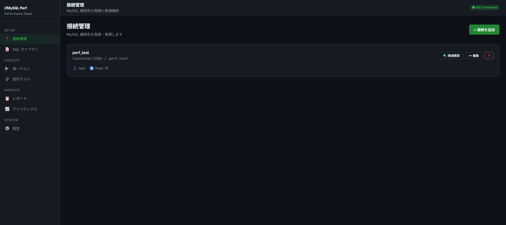
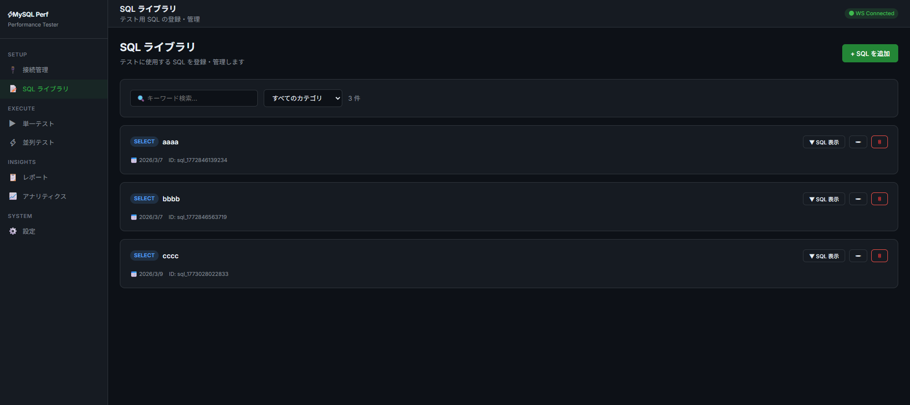
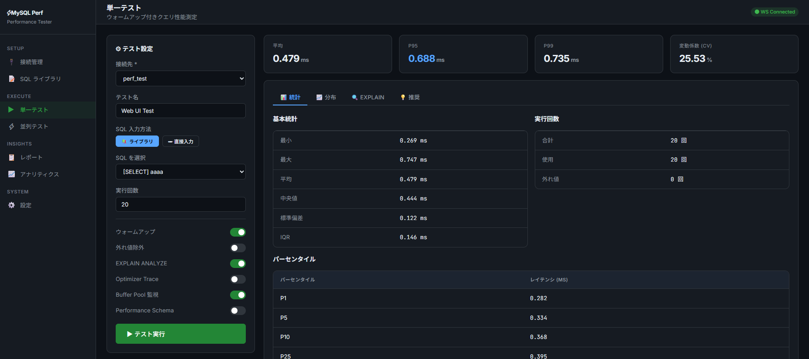
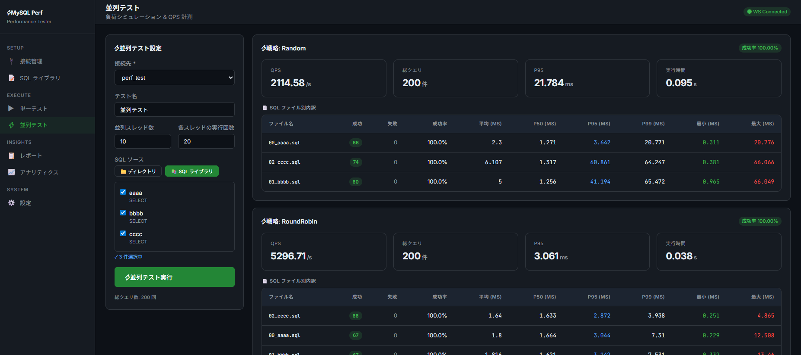

# Web UI ガイド

ブラウザから MySQL 接続の管理・テスト実行・結果確認ができます。

## 起動方法

2つのターミナルで別々に起動します。

```bash
# ターミナル1: API サーバー
cd web && node server.js

# ターミナル2: フロントエンド
cd web-ui && npm run dev
```

ブラウザで `http://localhost:5173` を開きます。
画面右上に **WS Connected** と表示されれば正常に接続されています。

---

## 画面構成

サイドバーのメニューは3セクションに分かれています。

```
SETUP    : 接続管理 / SQL ライブラリ
EXECUTE  : 単一テスト / 並列テスト
INSIGHTS : レポート / アナリティクス
SYSTEM   : 設定
```

---

## 接続管理



MySQL 接続先を登録・管理します。

**接続の追加:**
1. 右上の「+ 接続を追加」をクリック
2. ホスト・ポート・データベース名・ユーザー名・パスワードを入力
3. 保存後、「疎通確認」ボタンで接続テストを実行

**疎通確認** では `SELECT 1` を実行し、MySQLのバージョンと EXPLAIN ANALYZE の対応可否を確認します。

---

## SQL ライブラリ



テストに使用する SQL を登録・管理します。

- カテゴリ・キーワードで絞り込み検索が可能
- 登録した SQL は単一テスト・並列テストの「ライブラリから選択」で使用できます
- SQL の種別（SELECT / INSERT / UPDATE 等）がタグとして自動表示されます

---

## 単一テスト



ウォームアップ付きで1つの SQL のパフォーマンスを計測します。

**テスト設定:**

| 項目 | 説明 |
|---|---|
| 接続先 | 登録済みの接続を選択 |
| テスト名 | 任意の名前 |
| SQL 入力方法 | ライブラリから選択 / 直接入力 |
| 実行回数 | デフォルト 20 回 |
| ウォームアップ | ON/OFF（デフォルト ON） |
| 外れ値除去 | ON/OFF |
| EXPLAIN ANALYZE | ON/OFF（MySQL 8.0.18+ 必須） |
| Optimizer Trace | ON/OFF |
| Buffer Pool 監視 | ON/OFF |
| Performance Schema | ON/OFF |

**結果タブ:**
- **統計**: 最小/最大/平均/中央値/標準偏差/IQR・パーセンタイル表
- **分布**: レイテンシ分布のヒストグラム
- **EXPLAIN**: EXPLAIN ANALYZE の実行計画
- **提案**: 自動生成されるパフォーマンス改善推奨事項

---

## 並列テスト



複数の SQL を並列実行し、負荷時のスループットとレイテンシを計測します。

**テスト設定:**

| 項目 | 説明 |
|---|---|
| 接続先 | 登録済みの接続を選択 |
| 並列スレッド数 | デフォルト 10 |
| 各スレッドの実行回数 | デフォルト 20 |
| SQL ソース | ディレクトリ指定 / SQL ライブラリから選択 |

**結果表示:**

戦略（Random / RoundRobin / Sequential / CategoryBased）ごとに以下が表示されます:

| 指標 | 説明 |
|---|---|
| QPS | クエリ/秒（スループット） |
| 総クエリ数 | 全スレッドの合計実行数 |
| P95 | 95パーセンタイルレイテンシ |
| 実行時間 | テスト全体の所要時間 |

SQL ファイル別の詳細（成功/失敗数・成功率・P50/P95/P99）も確認できます。

---

## レポート

過去のテスト結果を一覧表示し、フォーマットを選んでエクスポートできます。

エクスポート対応フォーマット: **JSON / Markdown / HTML / CSV**

---

## アナリティクス

テスト結果の傾向分析・クエリ間の比較を行います。
